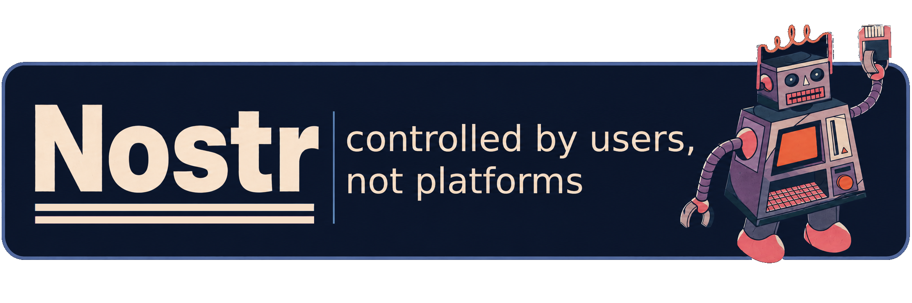
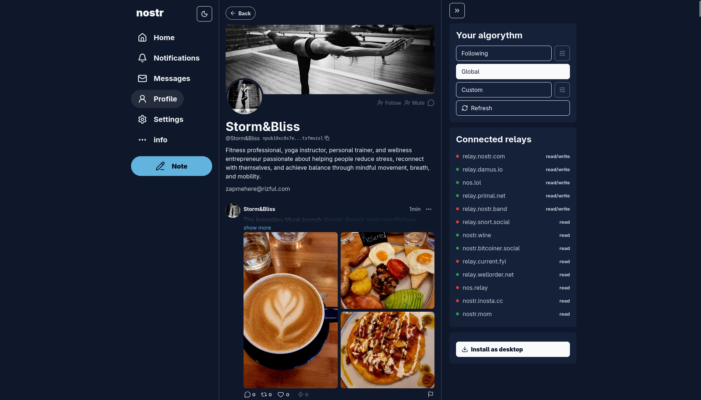
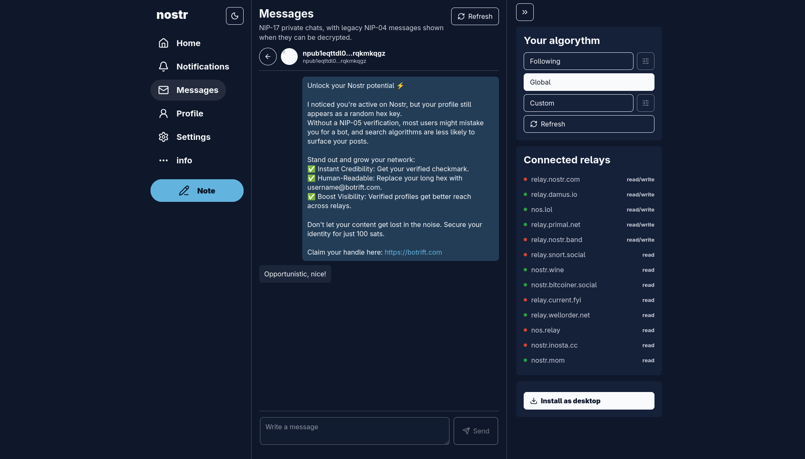
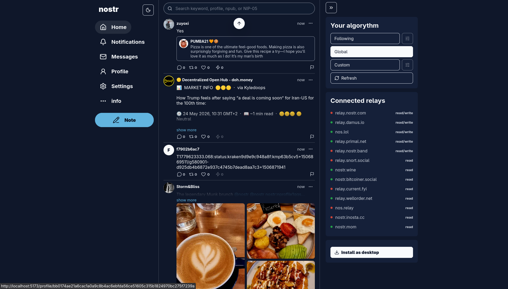
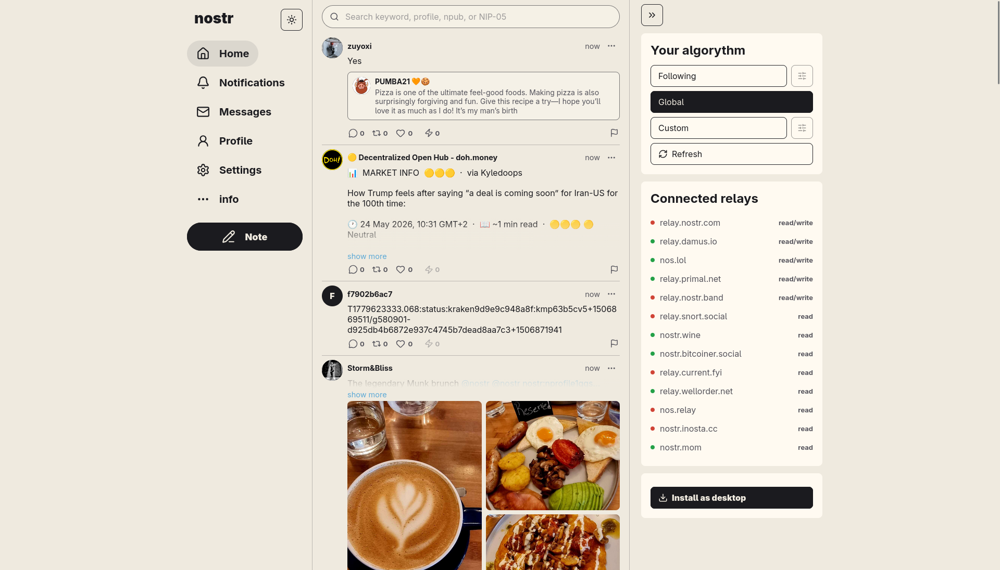

This Nostr social client is just one of the kazillion clients that exist.

Built by the LNbits team.

Learn more at [nostr.org](https://nostr.org).

<table>
  <tr>
    <td></td>
    <td></td>
  </tr>
  <tr>
    <td></td>
    <td></td>
  </tr>
</table>

## About

Nostr is a SvelteKit web client for reading, posting, and managing a Nostr social feed. It supports logged-out browsing, signed-in feeds, profiles, post threads, replies, reactions, reposts, messages, notifications, relay settings, light and dark themes, and installable PWA behavior.

The app is designed to work as a static web app, so it can be hosted on services such as GitHub Pages after building.

## Install

Install dependencies:

```bash
npm ci
```

Run the development server:

```bash
npm run dev
```

Build the web app:

```bash
npm run build
```

Preview the production build locally:

```bash
npm run preview
```

Run checks and tests:

```bash
npm run check
npm test -- --run
```
